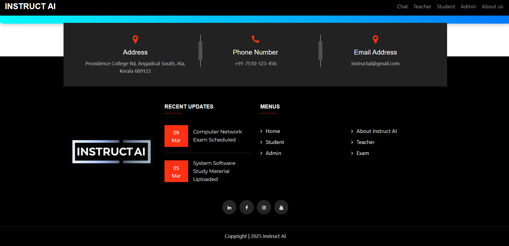
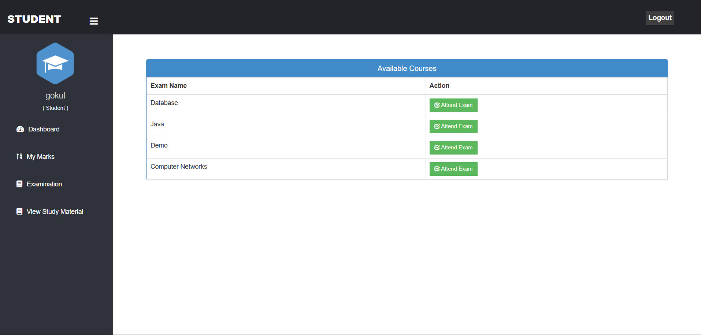
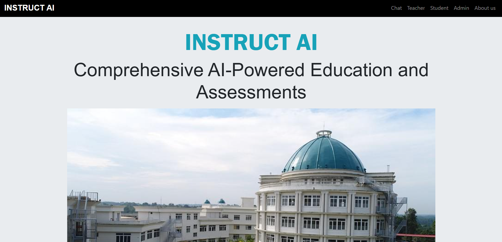

# Instruct-AI

Instruct AI – AI Powered Educational Content Generation and Proctoring System
Overview

Instruct AI is an AI-driven educational platform designed to automate content generation, assessment creation, and exam proctoring. The system leverages Large Language Models (LLMs) and Computer Vision techniques to provide personalized learning materials and ensure exam integrity.

The platform generates learning resources tailored to students’ needs and evaluates assessments automatically. It also integrates an AI-based proctoring system to monitor students during exams and detect suspicious activities.

Problem Statement

Traditional education systems face challenges such as:

Lack of personalized learning materials

Manual and time-consuming assessment evaluation

Difficulty maintaining exam integrity in online environments

Instruct AI addresses these issues using Artificial Intelligence and Machine Learning techniques.

Key Features
1. AI-Based Content Generation

Generates educational content using Large Language Models (LLMs).

Creates learning materials based on curriculum and user input.

2. Automated Assessment Creation

Generates quizzes and assessments automatically.

Provides instant feedback after evaluation.

3. AI-Based Answer Evaluation

Evaluates student responses using AI models.

Provides performance insights and feedback.

4. AI Exam Proctoring

Ensures exam integrity using computer vision techniques:

CNN-based eye movement detection

YOLO object detection for detecting mobile phones or suspicious objects

Monitoring student activity during exams

System Architecture

The system consists of the following modules:

Content Generation Module

Generates study materials using LLMs.

Assessment Module

Automatically generates exam questions.

Evaluation Module

AI evaluates student answers and provides feedback.

Proctoring Module

Uses CNN and YOLO to detect suspicious behaviour.

Technologies Used
Programming

Python

JavaScript

AI / Machine Learning

Large Language Models (LLMs)

Convolutional Neural Networks (CNN)

YOLO Object Detection

Frameworks & Libraries

Django (Backend)

OpenCV

NumPy

Tools

Git

GitHub

Performance

The system achieved:

90% accuracy in proctoring and assessment tasks

F1 Score: 0.87, showing strong precision and recall balance

Future Improvements

Integration with Learning Management Systems (LMS)

Improved student performance analytics

Enhanced AI-based cheating detection

Support for multiple languages

## Project Screenshots

